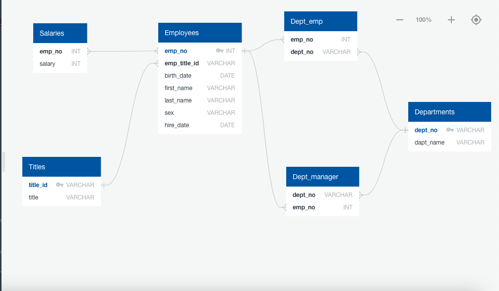

Employee Database: A Mystery in Two Parts
HW 9

## Background

It is a beautiful spring day, and it has been two weeks since I was hired as a new data engineer at Pewlett Hackard. My first major task is a research project on employees of the corporation from the 1980s and 1990s. All that remain of the database of employees from that period are six CSV files.

In this assignment, I will design the tables to hold the data in the CSVs, import the CSVs into a SQL database, and answer questions about the data. In other words, I will perform:

1. Data Engineering

3. Data Analysis

#### Data Modeling

I inspected the CSVs and sketched out an ERD of the tables.

  

#### Data Engineering

* I used the information from my ERD to create a table schema for each of the six CSV files.

* I then imported each CSV file into the corresponding SQL table. 

#### Data Analysis

Once I completed the database, I did the following:

1. Listed the following details of each employee: employee number, last name, first name, sex, and salary.

2. Listed first name, last name, and hire date for employees who were hired in 1986.

3. Listed the manager of each department with the following information: department number, department name, the manager's employee number, last name, first name.

4. Listed the department of each employee with the following information: employee number, last name, first name, and department name.

5. Listed first name, last name, and sex for employees whose first name is "Hercules" and last names begin with "B."

6. Listed all employees in the Sales department, including their employee number, last name, first name, and department name.

7. Listed all employees in the Sales and Development departments, including their employee number, last name, first name, and department name.

8. In descending order, I listed the frequency count of employee last names, i.e., how many employees share each last name.

## What's Going On ?

As I examined the data, I had a creeping suspicion that the dataset is fake. I surmise that my boss handed me spurious data in order to test my engineering skills. To confirm my hunch, I decided to take the following steps to generate a visualization of the data, with which I will confront my boss:

First I imported the SQL database into Pandas.

I then created 2 graphs to visualize my suspicions:

1. I created a histogram to visualize the most common salary ranges for employees.

2. I created a bar chart of average salary by title.

The data is fake!

## Jokes On Me

I marched into your boss's office to present the visualization. Turns out this was all an April Fool's Joke!
